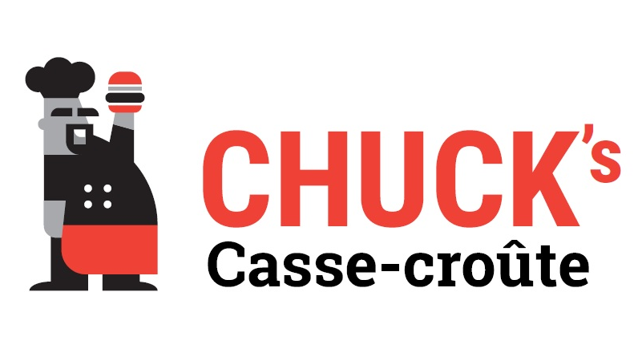

  

  <h1>Chuck’s casse-croûte</h1>
  
Poutines <strong>sa coche</strong>, burgers généreux et ambiance familiale à Gatineau.

  <a href="./menu.html" class="btn btn-primary">Voir le menu</a>
  <a href="tel:18195615353" class="btn btn-outline">Appeler maintenant</a>

---

# 🍟 Notre menu

Découvrez nos poutines classiques, burgers maison, hot-dogs, clubs et assiettes généreuses.

  <h3>Poutines</h3>
  
Classique, sauce blanche et poutines maison bien garnies.

  <h3>Burgers</h3>
  
Fromage & bacon, poulet, et le Chuck Burger signature.

  <h3>Classiques de casse-croûte</h3>
  
Hot-dogs, clubs, assiettes et plus encore.

  <a href="./menu.html" class="btn btn-primary">Voir le menu complet</a>

---

# 🧑‍🍳 L’histoire de Chuck

  

    Chuck’s casse-croûte, c’est un vrai casse-croûte de quartier à Gatineau :
    portions généreuses, ambiance locale et recettes qui traversent les années.
  

  <a href="./histoire.html" class="btn btn-outline">Lire l’histoire complète</a>

---

# ⭐ Avis & reviews

  

    Les clients parlent de portions généreuses, de poutines décadentes
    et d’un casse-croûte où on revient encore et encore.
  

  <a href="./reviews.html" class="btn btn-primary">Voir la page Avis</a>

  <em>Tu veux voir notre sélection d’avis en détail&nbsp;?</em> 
  <a href="https://share.google/MH1O5rEseR35d5RUn"
     target="_blank"
     rel="noopener noreferrer"
     class="btn btn-outline">
    Consulter les avis (document)
  </a>

---

# ❓ FAQ

  <h3>Est-ce qu’on peut commander pour emporter&nbsp;?</h3>
  
Oui, il suffit de nous appeler pendant les heures d’ouverture.

  <h3>Quels sont les jours d’ouverture&nbsp;?</h3>
  
Du mercredi au samedi, de 11 h à 18 h 45. Fermé dimanche, lundi et mardi.

  <h3>Est-ce qu’on peut manger sur place&nbsp;?</h3>
  
Oui, il y a une salle à manger familiale sur place.

  <a href="./faq.html" class="btn btn-outline">Voir toutes les questions</a>

---

# 📍 Contact & localisation

  

    📍 <strong>
      <a href="https://www.google.com/maps/search/?api=1&query=196+Chemin+de+la+Savane+Gatineau+QC+J8T+1R3"
         target="_blank"
         rel="noopener noreferrer">
        196 chemin de la Savane, Gatineau, QC J8T 1R3
      </a>
    </strong> 
    📞 <strong>819-561-5353</strong> 
    Ouvert du mercredi au samedi : 11 h – 18 h 45.
  

  <a href="./contact.html" class="btn btn-primary">Informations complètes</a>

---

<!-- JSON-LD SEO LocalBusiness -->

